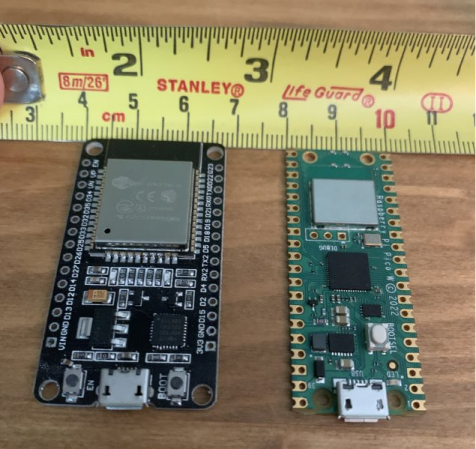
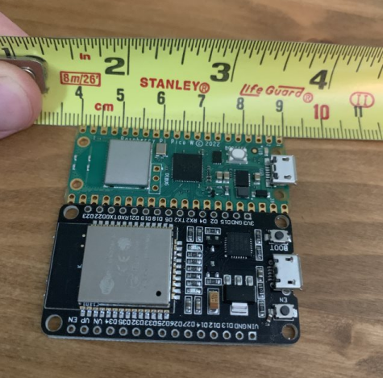

# Remote Bluetooth Powered Key fob for Old Car

## Links to similar projects listed from most similar to least
1. Remote Keyless System using bluetooth:
    [Open-Source-RKS.][1]
    RKS is a proximity system that is triggered by the detection of an physical authorized key.  Systems like these are typically used in modern vehicles as a convenient way to unlock your car without digging your key out of your bag.  This project uses bluetooth which might not be as secure as I would like for a vehicle unlocking device, so instead I would use something like [ESP-NOW][4] in my version.  

2. "Smart Home" door unlocking mechanism using esp32 bluetooth:
    [ESP32 Cam-Based Smart Bluetooth Lock][2].
    This system is used to unlock a door in your house without a key or RFID chip, it just connects to a phone via bluetooth which then authorizes the opening of the door. 
3. Two way communication between two ESP32 microcontrollers using WiFi module:
    [ESP-NOW Two-Way Communication Between ESP32 Boards][3].  This Project uses the [ESP-NOW protocol][4] to send messages of up to 250 bytes in length without using WiFi.
4. Bluetooth controlled robot car using ESP32 and Android phone:
    [Bluetooth controlled car][5].  In this project, you use an ESP32 and it's built-in Bluetooth module to control a robot car.

## Important protocols
1. [ESP-NOW][4] is a WiFi protocol that doesn't require a network connection/router to function.  It functions similar to a peer to peer network.  It simplifies the upper 5 layers of WiFi network communication (Network, Transport, Session, Presentation, and Application) are simplified into one layer in ESP-NOW, making it more power efficient and responsive.  I think that for a hacker standing by your car this would be harder to figure out how to crack and unlock (obviously you could just break a window but that is outside the scope of this project).
2. [Bluetooth][6] The ESP32 can use the standard Bluetooth LE (Low Energy) protocol to communicate to other bluetooth compatible devices, such as a phone, laptop, or another ESP32-like device.  

## Microcontrollers
The two options for microcontrollers that I have for this project are the [Raspberry Pi Pico Wireless][9] or the [ESP32][10].  I picked these particular microcontrollers because they are very inexpensive ($6 each for the Pico, if you can find them in stock, and around $8 to $12 each for the ESP32 depending on where you get them, I got mine on eBay).

## Important Languages
Both ESP32 and the Raspberry Pi Pico support [C++][8] ([C++ for Pico][12]) using Arduino IDE, or they also support [MicroPython][7] ([MicroPython for Pico][11]) using the Thonney IDE.  MicroPython is a lightweight version of Python designed for low power devices such as microcontrollers.

## Choosing the right microcontrollers
### Power draw:  
- The ESP32 at idle draws a meer 0.3 watts but it can ramp up as high as 3.0 watts under full load using WiFi. [Source][13].
- Unfortunately since the Pico W is really new I could not find a decisive test of power draw done on it, but according to [this forum thread][14] people seem to be drawing around 50 to 150 mA at 4.6V, this equates to around 4.6V * 0.05A = 0.23W at minimum and 4.6V * 0.15A = 0.69W at maximum.  
- The Pico W is the obvious winner because inside a small custom key fob, where you don't have much room for a large battery, you need a device that uses the least power possible.
### Physical size:
As seen below, the ESP32 (black board) measures in at 2.7 by 5 centimeters whereas the Pico W (green board) comes in at only 2 by 5 CM    
    
They are both pretty much take up the same footprint, but in terms of a custom key fob the extra 7 millimeters width would make a noticeable difference in the size of the finished device.  So I think the Pico W wins again here.
### Module support:
- The ESP32 has Bluetooth LE support for both [C++][15] and [MicroPython][16], it also has support for the customized low-power WiFi protocol [ESP-NOW][4], but I believe this is for C++ only.
- Unfortunately, as of writing this the Pico W is still very new and Bluetooth LE is currently disabled in the MicroPython firmware, and C++ Bluetooth libraries are incompatible with the pico's RP2040 chip.  So this leaves the Pico W with only WiFi, so the closest you could get is having one device serve as an access point and the other a client and communicate that way.
- This is a major victory for the ESP32, because of it's age it just has more libraries written for it.

[1]: https://github.com/fryefryefrye/Open-Source-RKS "Open Source Remote Keyless System"
[2]: https://www.electronicsforu.com/electronics-projects/hardware-diy/esp32cam-based-smart-bluetooth-lock "Smart Bluetooth Lock using ESP32"
[3]: https://randomnerdtutorials.com/esp-now-two-way-communication-esp32/ "ESP-NOW example project"
[4]: https://github.com/espressif/esp-now "ESP-NOW protocol github page"
[5]: https://www.androiderode.com/bluetooth-controlled-car-using-esp32-and-smartphone/ "Remote controlled car using bluetooth and smartphone"
[6]: https://espressif.com/sites/default/files/documentation/esp32_bluetooth_architecture_en.pdf "ESP32 Bluetooth Architecture PDF guide"
[7]: https://docs.micropython.org/en/latest/esp32/quickref.html "MicroPython documentation for ESP32"

[8]: https://espressif-docs.readthedocs-hosted.com/projects/arduino-esp32/en/latest/libraries.html "C++ documentation for ESP32"

[9]: https://www.raspberrypi.com/products/raspberry-pi-pico/ "Raspberry Pi Pico product page"

[10]: https://www.espressif.com/en/products/socs/esp32 "ESP32 product page"

[11]: https://www.raspberrypi.com/documentation/microcontrollers/c_sdk.html "Raspberry Pi Pico C++ documentation"

[12]: https://www.raspberrypi.com/documentation/microcontrollers/micropython.html "Raspberry Pi Pico MicroPython documentation"

[13]: https://therandomwalk.org/wp/esp32-power-consumption/ "ESP32 Power consumption information"

[14]: https://forums.raspberrypi.com/viewtopic.php?t=337145

[15]: https://www.arduino.cc/reference/en/libraries/esp32-ble-arduino/ "BLE ESP32 Arduino documentation"

[16]: https://docs.micropython.org/en/latest/library/bluetooth.html "BLE ESP32 MicroPython Docs"
