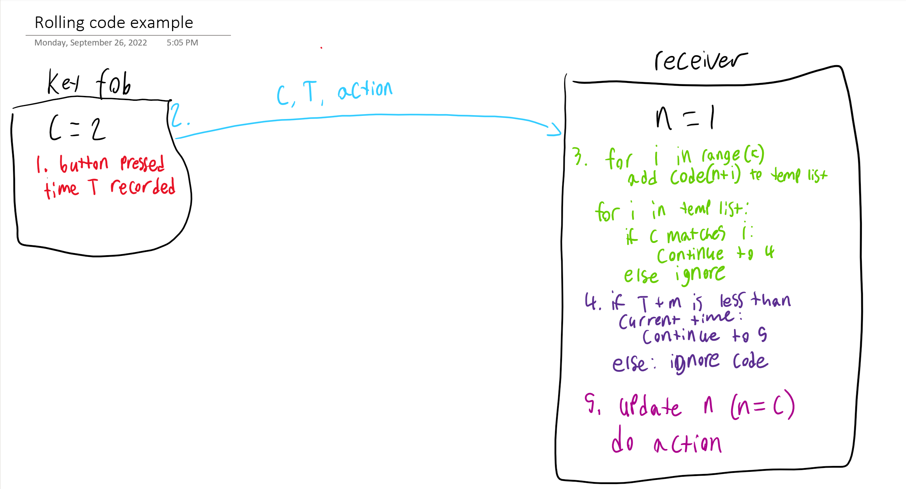

# Appendix

## MicroPython Code examples
### 1.a MicroPython WiFi example 1
```python
ssid = "PicoWAccessPoint"
password = "1234567890" ## This should be a secure password in final version, this is for testing purposes ONLY
ap = network.WLAN(network.AP_IF)
ap.config(essid=ssid, password=password)
ap.active(True)
print('Connection successful')
print(ap.ifconfig())
```
### 1.b MicroPython WiFi example 2
```python
def connect():
    wlan = network.WLAN(network.STA_IF)
    wlan.active(True)
    wlan.connect(ssid, password)
    
    tries = 0
    while not wlan.isconnected() and wlan.status() >= 0:
        print("Waiting to connect:")
        sleep(1)
        tries += 1
        
        if (tries == 10):
            raise RuntimeError("Unable to connect")
        
    if (wlan.isconnected()):
        print(f"connected, ip adress: {wlan.ifconfig()}")
```

### 1.c MicroPython WiFi example 3
```python
html = """<!DOCTYPE html>
<html>
    <head> <title>Pico W</title> </head>
    <body> <h1>Pico W</h1>
        <p>%s</p>
    </body>
</html>
"""
addr = socket.getaddrinfo('0.0.0.0', 80)[0][-1]

s = socket.socket()
s.bind(addr)
s.listen(1)

# Listen for connections
while True:
    try:
        stateis = "LED is OFF"
        cl, addr = s.accept()
        print('client connected from', addr)
        request = cl.recv(1024)
        print(request)

        request = str(request)
        led_on = request.find('/light/on')
        led_off = request.find('/light/off')
        print( 'led on = ' + str(led_on))
        print( 'led off = ' + str(led_off))

        if led_on == 6:
            print("led on")
            led.on()
            stateis = "LED is ON"

        if led_off == 6:
            print("led off")
            led.off()
            stateis = "LED is OFF"

        response = html % stateis

        cl.send('HTTP/1.0 200 OK\r\nContent-type: text/html\r\n\r\n')
        cl.send(response)
        cl.close()

    except OSError as e:
        cl.close()
        print('connection closed')
```

### 1.d MicroPython WiFi example 4
```python
def sendServerMessage(mes):
    r = urequests.get(f"http://192.168.4.1/light/{mes}")
    print(r.content)
    r.close()
```

## ESP32 (C++) Examples
### 2.a ESP-NOW example 1
```c++
// MAC Address of the ESP32 to send message to
uint8_t broadcastAddress[] = {0x94, 0xB5, 0x55, 0x26, 0x44, 0xB8};
esp_now_peer_info_t peerInfo;

//.... More declarations here

void setup(){
  // Register a peer
  memcpy(peerInfo.peer_addr, broadcastAddress, 6);
  peerInfo.channel = 0;
  peerInfo.encrypt = false;  // NOTE: ESP-NOW messages can be encrypted

  // Add the peer
  if (esp_now_add_peer(&peerInfo) != ESP_OK) {
    Serial.println("Failed to add peer");
    return;
  }
}
```

### 2.b ESP-NOW example 2
```c++
typedef struct struct_message {
    String a;
    bool b;
} struct_message;

struct_message example;
```

### 2.c ESP-NOW example 3
```c++
void loop() {
  esp_err_t result = esp_now_send(broadcastAddress, (uint8_t *) &example, sizeof(LED_Off_Sig));
  reportError(result);
  delay(2000);

}
```

## Security examples
### 3.a rolling code diagram
